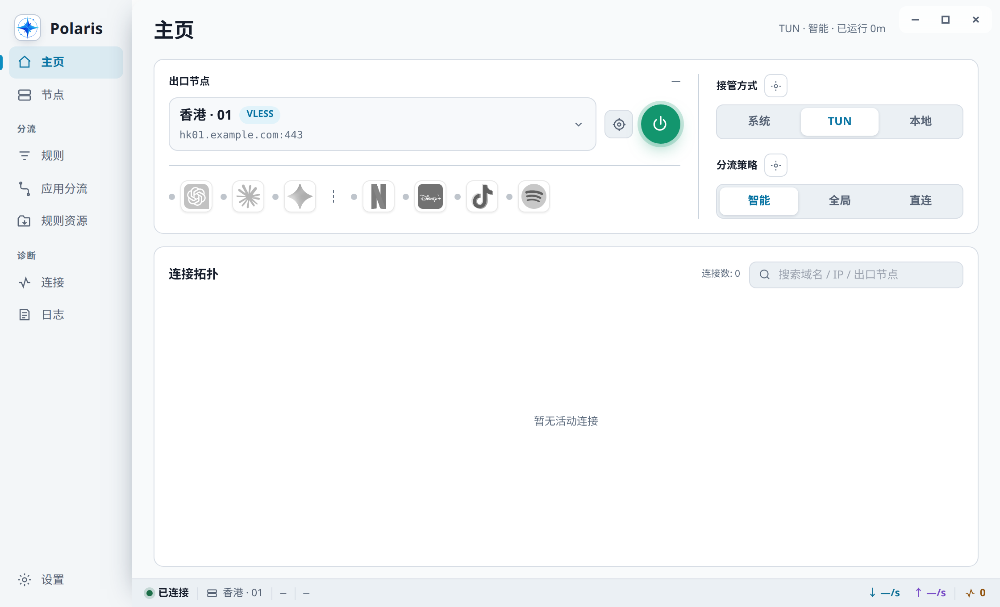
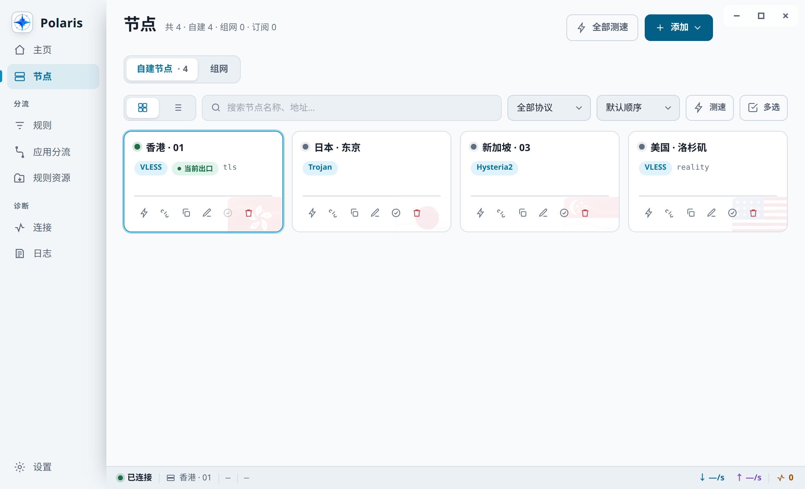
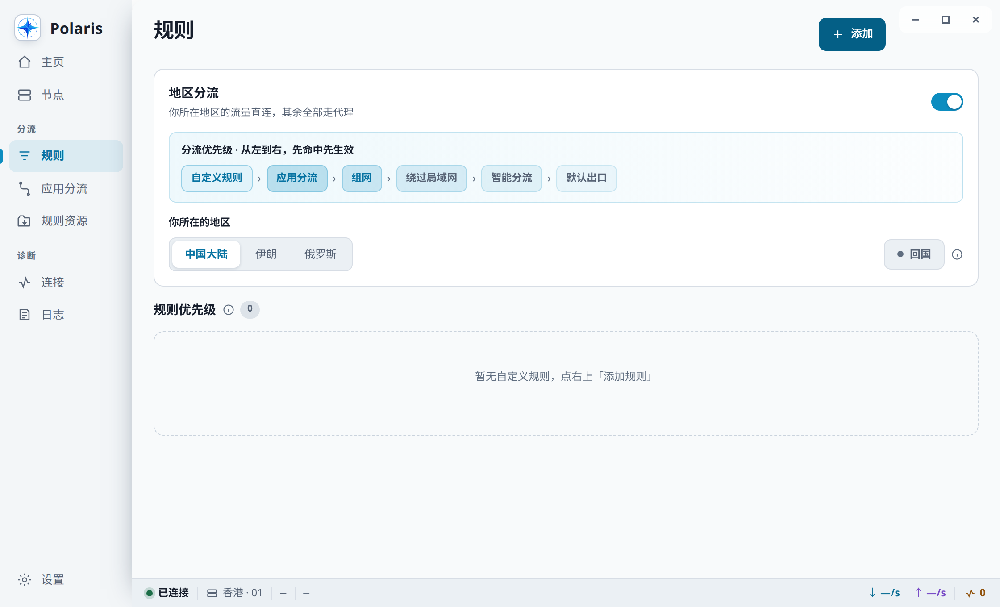
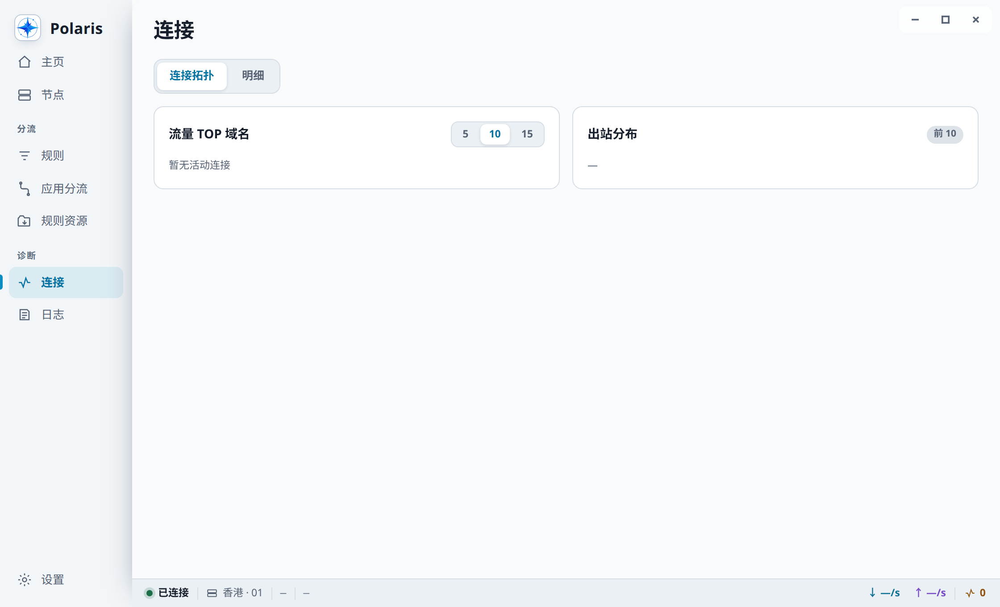
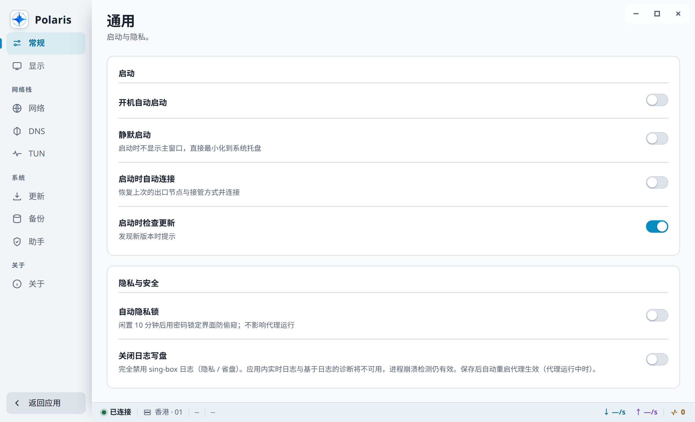

# Polaris

<div align="center">

[简体中文](README.md) · [English](README.en.md) · [繁體中文](README.zh-TW.md) · [Русский](README.ru.md) · **فارسی**

[](https://github.com/polaris-arch/Polaris/releases/latest)
[](https://github.com/SagerNet/sing-box)
[](#نصب)
[](LICENSE)
[](https://github.com/polaris-arch/Polaris/stargazers)

</div>

<div dir="rtl">

**Polaris** — یک کلاینت پروکسی شبکه چندسکویی بر پایه sing-box. ساخته‌شده با Tauri 2 (ترکیب Rust و React).



## قابلیت‌ها

| حوزه | قابلیت‌ها |
|---|---|
| شیوه گرفتن ترافیک | TUN · پروکسی سیستمی · پورت محلی |
| مسیریابی | هوشمند / سراسری / مستقیم · قوانین سفارشی · مسیریابی بر پایه برنامه · مسیریابی منطقه‌ای (شامل بازگشت به چین) |
| پروتکل‌ها | VLESS · VMess · Trojan · Hysteria 2 / 1 · TUIC · Shadowsocks · AnyTLS · Naive · Snell · SOCKS · HTTP · SSH · Tor · OpenConnect · OpenVPN |
| شبکه خصوصی | WireGuard · Tailscale · WARP؛ OpenConnect و OpenVPN نیز پس از اعلام زیرشبکه‌های داخلی در همین دسته قرار می‌گیرند |
| DNS | FakeIP · DoH / DoT · رقابت هم‌زمان بین حل‌کننده‌ها · راهبرد IPv6 · محافظت در برابر نشت |
| عیب‌یابی | توپولوژی اتصال‌ها · گزارش زنده · سنجش سرعت گره‌ها · تشخیص باز بودن سرویس‌های پخش و هوش مصنوعی |
| بهره‌برداری | مدیریت اشتراک · به‌روزرسانی برخط هسته · پشتیبان‌گیری و بازیابی پیکربندی · قفل حریم خصوصی · ماندگاری در سینی سیستم |
| به‌روزرسانی برنامه | کانال پایدار / آزمایشی · دانلود دوبارهٔ نسخهٔ فعلی · بررسی چکیدهٔ نصب‌کننده |
| بهینه‌سازی حافظه | آزادسازی WebView اصلی پس از ۱۰ دقیقه پنهان یا کمینه بودن رابط؛ آمار، اتصال‌ها و گزارش‌ها تنها هنگام نیاز مشترک می‌شوند |

</div>

<table>
<tr>
<td width="50%"><br><sub>مدیریت گره‌ها و سنجش سرعت</sub></td>
<td width="50%"><br><sub>قوانین مسیریابی سفارشی</sub></td>
</tr>
<tr>
<td><br><sub>اتصال‌های زنده</sub></td>
<td><br><sub>تنظیمات</sub></td>
</tr>
</table>

<div dir="rtl">

## نصب

بسته مناسب سکوی خود را از [Releases](https://github.com/polaris-arch/Polaris/releases) دانلود کنید.

| سکو | فایل |
|---|---|
| macOS | `Polaris_1.0.0_aarch64-mac.dmg` / `Polaris_1.0.0_x64-mac.dmg` |
| Windows | `Polaris_1.0.0_x64-win-setup.exe`؛ نسخه قابل حمل: `Polaris_1.0.0_x64-win-Portable.zip` |
| Linux | `Polaris_1.0.0_amd64-linux.deb` / `Polaris_1.0.0_amd64-linux.AppImage` |
| Android | `Polaris_1.0.0_arm64-v8a-android.apk` / `Polaris_1.0.0_armeabi-v7a-android.apk` / `Polaris_1.0.0_universal-android.apk` (universal: فقط ARMv8/ARMv7) |

بسته‌ها با گواهی پولی امضای کد امضا نمی‌شوند، بنابراین نخستین اجرا روی هر سکو نیازمند یک گام تأیید دستی است.

نصب‌کننده ویندوز، WebView2 Runtime را در خود جای نمی‌دهد؛ اگر سیستم فاقد آن باشد، به‌صورت برخط دریافت می‌شود. کاربران نسخه‌های سبک‌شده / LTSC یا نسخه قابل حمل که Runtime را ندارند، ابتدا [Microsoft Edge WebView2 Runtime](https://developer.microsoft.com/microsoft-edge/webview2/) را از سایت مایکروسافت نصب کنند. Polaris نصب‌کننده آفلاین WebView2 ارائه نمی‌دهد.

### نخستین نصب روی macOS

۱. فایل DMG را باز کنید و `Polaris.app` را به پوشه «Applications» بکشید؛ برنامه را مستقیماً از داخل DMG اجرا نکنید.

۲. «Terminal» را باز کنید و این دستور را اجرا کنید:

</div>

```bash
xattr -cr /Applications/Polaris.app
```

<div dir="rtl">

۳. Polaris را از «Applications» اجرا کنید. پس از هر نصب یا جایگزینی دستی از یک DMG تازه‌دانلودشده، دستور بالا را یک بار اجرا کنید؛ به‌روزرسانی‌های درون‌برنامه‌ای خودشان ویژگی قرنطینه را پاک می‌کنند.

اگر Polaris در مسیر دیگری نصب شده است، مسیر داخل دستور را با مسیر واقعی `.app` جایگزین کنید. `xattr -cr` ویژگی‌های گسترده آن بسته برنامه را به‌صورت بازگشتی پاک می‌کند، پس آن را تنها روی بسته Polaris که از Releases همین مخزن دانلود و مورد اعتماد تشخیص داده شده اجرا کنید. فایل `README First.txt` در ریشه DMG همین راهنما را به پنج زبان همراه دارد. اگر پیام تنها می‌گوید توسعه‌دهنده قابل تأیید نیست، می‌توانید به‌جای آن در Finder روی Polaris کلیک راست کنید ← «Open» ← و دوباره تأیید کنید.

### نخستین نصب روی Windows

هنگام نمایش SmartScreen گزینه «More info» ← «Run anyway» را انتخاب کنید.

## ساخت

نیازمند Rust stable، Node.js 24+ (در CI اکنون Node 26)، pnpm 11.24.0، Go و [Tauri CLI 2](https://v2.tauri.app/).

</div>

```bash
npm install -g "@tauri-apps/cli@$(cat scripts/tauri-cli.version)"
pnpm --dir ui install --frozen-lockfile   # وابستگی‌های رابط کاربری
# هسته sing-box: بسته چهارسکویی ساخته‌شده از کد منبع و وصله‌های قفل‌شده (خروجی workflow «Desktop Core Sources» در CI برای همین commit)
node scripts/fetch-core.mjs --bundle-dir=<core-bundle-dir> --candidate="$(git rev-parse HEAD)"
# روش دریافت بستهٔ هسته یا ساخت هسته فقط برای سکوی فعلی: docs/build-and-package.en.md، بخش "Two ways to obtain the core bundle"
node scripts/fetch-cronet.mjs --platform=linux  # دریافت libcronet.so در کنار هسته Linux
node scripts/fetch-dashboard.mjs   # دریافت پنل داخلی
tauri build --config src-tauri/tauri.linux.conf.json
```

<div dir="rtl">

هسته در مخزن نگهداری نمی‌شود و باید پیش از بسته‌بندی دریافت شود. سوئیچ `--config` مخصوص هر سکو اختیاری نیست: نبود آن **بسته‌ای بدون هسته** می‌سازد، آن هم بدون هیچ خطایی در زمان ساخت — خرابی تنها در زمان اجرا آشکار می‌شود. شرح کامل، تقسیم کار در CI و قرارداد انتخاب بسته برای نصب‌کننده ویندوز و به‌روزرسان در [ساخت و بسته‌بندی](docs/build-and-package.en.md) آمده است.

دروازه‌های توسعه:

</div>

```bash
cargo fmt --all -- --check
cargo clippy --workspace --all-targets -- -D warnings
cargo test --workspace
cd ui && npx pnpm@11.24.0 test
```

<div dir="rtl">

## معماری

</div>

```
ui/          React + Zustand + Vite + Tailwind
src-tauri/   فرایند اصلی Tauri 2
crates/      ۱۸ crate دامنه‌ای (config-engine / core-supervisor / helper / updater / …)
resources/   هسته sing-box + libcronet (در زمان ساخت دریافت می‌شوند، در مخزن نیستند)
```

<div dir="rtl">

هسته به‌صورت یک فرایند فرزند sidecar اجرا می‌شود و از طریق صفحه مدیریت gRPC کنترل می‌گردد. کارهای نیازمند دسترسی ویژه — راه‌اندازی هسته برای TUN و تصاحب سیستم — در هر سه سکو (macOS / Windows / Linux) به helperهای نوشته‌شده با Rust سپرده می‌شود؛ مسیر پروکسی سیستمی که به helper نیاز ندارد، مستقیماً توسط crate ‏`system-integration` در سمت برنامه مدیریت می‌شود و بازگردانی تنظیمات نیز بر عهده همان است.

## مستندات

| فایل | محتوا |
|---|---|
| [docs/architecture.md](docs/architecture.md) | لایه‌بندی فعلی، تراکنش‌های اجرا، DNS / مسیریابی، مرزهای دسترسی ویژه و معیار تفکیک فایل‌های بزرگ (فقط به زبان چینی) |
| [docs/build-and-package.en.md](docs/build-and-package.en.md) | ساخت، CI، ثابت‌های بسته‌بندی، قرارداد انتخاب بسته توسط به‌روزرسان |
| [docs/troubleshooting.fa.md](docs/troubleshooting.fa.md) | توضیح نسخه‌های بدون امضا، صفحه سفید / خرابی تصویر / کرش GPU |

تصاویر با دستور `node scripts/capture-screenshots.mjs` ساخته می‌شوند: کروم بدون رابط گرافیکی، خروجی ساخت رابط کاربری را با داده‌های نمونه تزریق‌شده رندر می‌کند — نه نصب برنامه لازم است و نه اجرای هسته.

## وابستگی‌های بالادست

| پروژه | نقش |
|---|---|
| [sing-box](https://github.com/SagerNet/sing-box) | هسته پروکسی (فرایند فرزند sidecar) |
| [Tauri 2](https://github.com/tauri-apps/tauri) | بستر اجرای دسکتاپ |
| [cronet-go](https://github.com/SagerNet/cronet-go) | libcronet برای NaiveProxy |
| [sing-box-dashboard](https://github.com/SagerNet/sing-box-dashboard) | پنل داخلی |
| [meta-rules-dat](https://github.com/MetaCubeX/meta-rules-dat) | مجموعه قوانین و داده‌های جغرافیایی (`.srs`) |

حق نشر هر مؤلفه نزد پدیدآورندگان آن باقی است. مؤلفه‌هایی که به شکل زیرفرایند یا فایل باینری یکپارچه شده‌اند در `NOTICE` فهرست شده‌اند؛ وابستگی‌های سطح کد که به خروجی لینک می‌شوند (Tauri / React / چند صد crate زبان Rust) بسته‌به‌بسته در `THIRD-PARTY-LICENSES.md` ثبت شده‌اند.

## دامنه کاربرد و سلب مسئولیت

Polaris یک کلاینت پروکسی شبکه و ابزار عیب‌یابی همه‌منظوره است. این نرم‌افزار گره پروکسی، اشتراک یا سرویس شبکه ارائه، فروش یا نگهداری نمی‌کند. تنها در شرایطی از آن استفاده کنید که قوانین و مقررات محل خود، شرایط خدمات مربوط و مقررات شبکه‌ای را که در آن هستید رعایت می‌کنید و مجوزهای لازم را دارید؛ استفاده از آن برای دسترسی غیرمجاز، نقض حقوق دیگران یا هر سوءاستفاده غیرقانونی دیگر ممنوع است. ارزیابی قابل اعتماد بودن پیکربندی‌ها، گره‌ها و منابع شخص ثالث بر عهده کاربر است و کاربر مسئول رفتار خود و پیامدهای آن است.

این نرم‌افزار «همان‌گونه که هست» ارائه می‌شود و هیچ تضمینی درباره در دسترس بودن شبکه، ناشناس ماندن، امنیت، دسترسی به سرویسی خاص یا یکپارچگی داده‌ها نمی‌دهد. تغییرات TUN، پروکسی سیستمی، DNS و مسیریابی ممکن است اتصال شبکه را موقتاً مختل کند؛ پیش از عملیات مهم از پیکربندی خود پشتیبان بگیرید. جز در مواردی که قانون حاکم به‌صراحت مقرر کرده باشد، نگهدارندگان و مشارکت‌کنندگان مسئول هیچ زیان مستقیم یا غیرمستقیمی که از استفاده یا ناتوانی در استفاده از این نرم‌افزار ناشی شود نیستند. این متن مشاوره حقوقی یا حرفه‌ای نیست.

## پروانه

کد منبع خودِ Polaris با پروانه MIT است (به `LICENSE` مراجعه کنید). **اما شرایط انتشار محصول ساخته‌شده بسته به پلتفرم متفاوت است:**

- **دسکتاپ (Windows / macOS / Linux): MIT.** sing-box (با پروانه GPLv3) به‌صورت فرایند فرزند sidecar یکپارچه شده و بر پایه‌ی موضع mere aggregation بر پروانه این پروژه اثری ندارد. **این موضع در دادگاه آزموده نشده است** — به `NOTICE` مراجعه کنید.
- **اندروید: در کل GPLv3.** در این پلتفرم sing-box تنها می‌تواند به شکل libbox درون فرایند برنامه بارگذاری شود (توصیفگر tun فقط از راه یک واسط درون‌فرایندی در دسترس است)، بنابراین mere aggregation کاربرد ندارد؛ لایه‌ی Kotlin نیز از sing-box-for-android با پروانه GPLv3 پورت شده است. هر کس APK را بگیرد GPLv3 دریافت می‌کند؛ هر کس تنها فایل‌های منبع MIT این مخزن را بردارد همچنان MIT دریافت می‌کند.

مؤلفه‌های شخص ثالث و استدلال کامل در `NOTICE` آمده است.

## روند ستاره‌ها

</div>

<a href="https://www.star-history.com/?repos=polaris-arch%2FPolaris&type=date&legend=top-left">
  <picture>
    <source media="(prefers-color-scheme: dark)" srcset="https://api.star-history.com/chart?repos=polaris-arch/Polaris&type=date&theme=dark&legend=top-left&sealed_token=TJg9RA5l3wyd1IgSMMq05QxhNvxS_OcrWbDJxZuwdUwgs-zVIBeoZz2j6swI3y5BxlztkoJMSkkxL6ZbZtw6oyqaRHZSAv0ZS60aVPPuBMdvm8tkxUjyKN1ttiVtPUwJEKObGpBH7BsPhjr6JwFfl_20UYjxgRVOq_V_Q6gKleib6K8LqP3K3nSwPvIJ" />
    <source media="(prefers-color-scheme: light)" srcset="https://api.star-history.com/chart?repos=polaris-arch/Polaris&type=date&legend=top-left&sealed_token=TJg9RA5l3wyd1IgSMMq05QxhNvxS_OcrWbDJxZuwdUwgs-zVIBeoZz2j6swI3y5BxlztkoJMSkkxL6ZbZtw6oyqaRHZSAv0ZS60aVPPuBMdvm8tkxUjyKN1ttiVtPUwJEKObGpBH7BsPhjr6JwFfl_20UYjxgRVOq_V_Q6gKleib6K8LqP3K3nSwPvIJ" />
    
  </picture>
</a>
